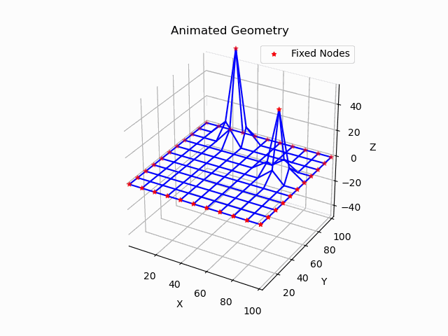

# Dynamic Relaxation with Kinetic Damping for Form Finding

All algorithms written by T gordon.

## Overview

Dynamic Relaxation (DR) is a form-finding technique that employs damping forces to iteratively adjust a structure's geometry, enabling the efficient determination of a stable equilibrium configuration for structures under external loads, particularly cable-net structures with pre-stress.

This repository provides both a Python and a (work in progress) Matlab implementation of the method as proposed by Barnes, utilizing kinetic damping to achieve stable convergence without reliance on a predefined damping factor. It includes functions for mesh generation, applying deformations, and visualizing the results.

NB: No guarantees or liability regarding the use of this code are given.

---

## Features

- **Mesh generation**: Create square or triangular meshes for structural simulations.
- **Dynamic Relaxation solver**: Iterative solution to find resulting minimum energy surface 
- **Shape function application**: Apply predefined shape functions (e.g., pyramid, sinusoidal) to simulate imposed deformations.
- **Visualization**: Generate plots and GIFs to show the simulation process and results.

---

## GIF of the Simulation Process

  
_This GIF shows the simulation process of applying forces and observing the deformation of the structure over time._

---

## With thanks

- **Michael Barnes** : for the original work in developing the DR methon for form finding
- **Shervin Azadi & Pirouz Nourian**:  for a similar implementation of the original method by Barnes, without the later development of kinetic energy based damping
